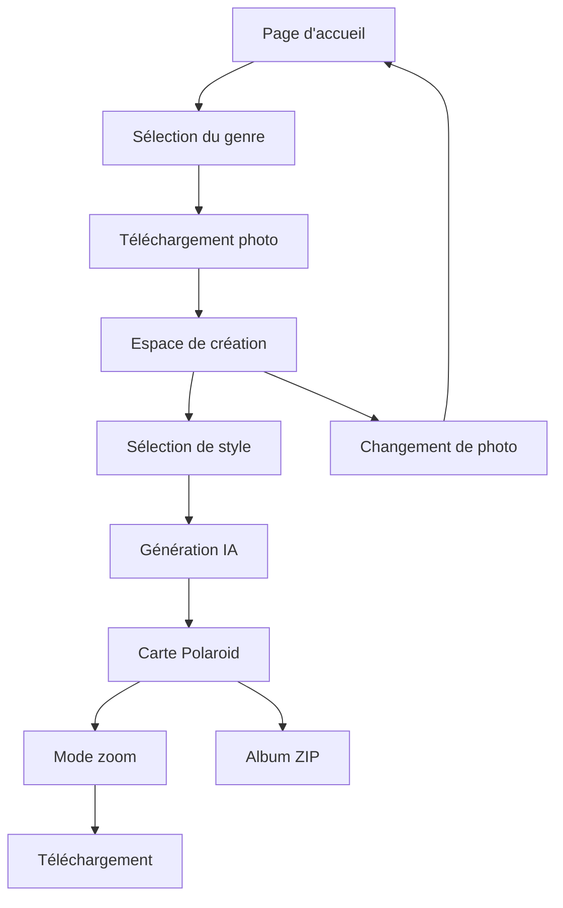

# Document de Spécifications Produit - Ton Profil IA

## 1. Vue d'ensemble du produit

**Ton Profil IA** est une application web innovante qui permet aux utilisateurs de transformer leurs photos de portrait en créations artistiques uniques grâce à l'intelligence artificielle. L'application utilise le modèle Google Gemini 2.5 Flash pour générer des variations créatives d'une photo originale selon différents thèmes et styles.

L'objectif principal est de démocratiser la création artistique assistée par IA en offrant une expérience ludique et accessible, permettant aux utilisateurs d'explorer différentes facettes de leur identité visuelle à travers plus de 100 styles prédéfinis.

## 2. Fonctionnalités principales

### 2.1 Rôles utilisateur

L'application ne nécessite pas de système d'authentification complexe. Tous les utilisateurs ont accès aux mêmes fonctionnalités avec une limitation de 5 générations par session pour la version démo.

### 2.2 Module de fonctionnalités

Notre application se compose des pages essentielles suivantes :

1. **Page d'accueil** : Interface de téléchargement, sélection du genre, configuration initiale
2. **Espace de création** : Bureau virtuel avec cartes Polaroid interactives, sélecteur de styles
3. **Visualisation agrandie** : Mode zoom pour examiner les créations en détail

### 2.3 Détails des pages

| Nom de la page | Nom du module | Description des fonctionnalités |
|----------------|---------------|----------------------------------|
| Page d'accueil | Interface de téléchargement | Télécharger une photo (PNG/JPEG/WebP), sélectionner le genre (homme/femme), saisir un nom personnalisé optionnel |
| Page d'accueil | Sélecteur de genre | Choisir entre "homme" et "femme" pour adapter les prompts IA |
| Espace de création | Bureau virtuel | Afficher les cartes Polaroid générées avec positionnement aléatoire et interactions drag & drop |
| Espace de création | Sélecteur de styles | Naviguer entre 14 catégories de styles, cliquer pour générer une transformation |
| Espace de création | Gestion des téléchargements | Télécharger individuellement ou créer un album ZIP complet |
| Visualisation agrandie | Mode zoom | Afficher l'image en grand format, télécharger ou supprimer l'image |

## 3. Processus principal

### Flux utilisateur principal

1. **Initialisation** : L'utilisateur arrive sur la page d'accueil et sélectionne son genre
2. **Configuration** : Saisie optionnelle d'un nom personnalisé pour les créations
3. **Téléchargement** : Upload d'une photo de portrait claire et de qualité
4. **Création** : Navigation dans les catégories de styles et génération à la demande
5. **Interaction** : Manipulation des cartes Polaroid sur le bureau virtuel
6. **Sauvegarde** : Téléchargement individuel ou création d'un album ZIP

## 4. Design de l'interface utilisateur

### 4.1 Style de design

- **Couleurs principales** : Palette terre avec bois sombre (#211a15, #3a2e27) et accents ambrés (#f59e0b, #fbbf24)
- **Style des boutons** : Design "Permanent Marker" avec effets de rotation et d'ombre pour les actions principales
- **Police et tailles** : "Permanent Marker" pour les titres, "Roboto" pour le texte courant
- **Style de mise en page** : Interface en grille responsive avec sidebar fixe et bureau principal
- **Icônes et émojis** : Icônes SVG minimalistes, style photographique vintage

### 4.2 Aperçu du design des pages

| Nom de la page | Nom du module | Éléments UI |
|----------------|---------------|-------------|
| Page d'accueil | Interface principale | Fond dégradé sombre, logo centré, bouton CTA amber avec ombre portée, champs de saisie avec bordures stone |
| Espace de création | Bureau virtuel | Grille responsive, cartes Polaroid blanches avec ombres, animations Framer Motion fluides |
| Espace de création | Sidebar de contrôle | Panneau semi-transparent avec backdrop-blur, boutons catégories en pills, scrolling vertical |
| Mode zoom | Overlay modal | Fond noir semi-transparent, carte agrandie centrée, boutons d'action en bas |

### 4.3 Responsivité

L'application est conçue mobile-first avec adaptation desktop. L'interface s'adapte automatiquement aux écrans tactiles avec des zones de clic optimisées et des interactions drag & drop compatibles touch.