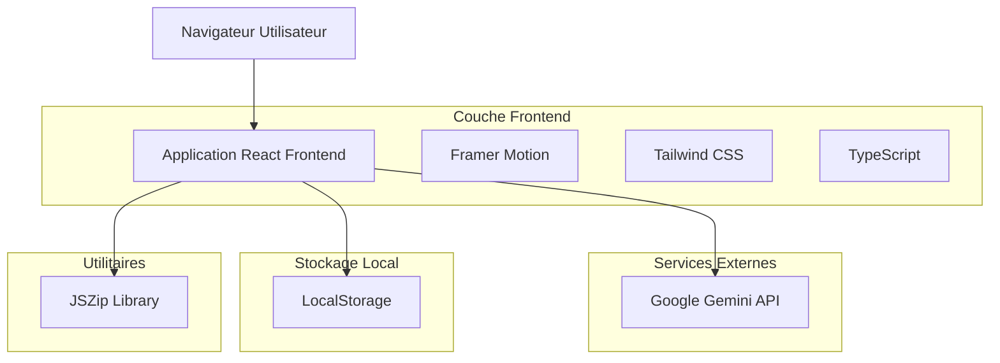
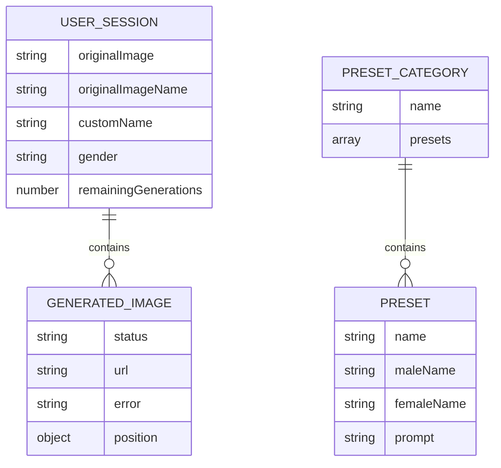

# Document d'Architecture Technique - Ton Profil IA

## 1. Conception de l'architecture



## 2. Description des technologies

- **Frontend** : React@19.1.1 + TypeScript@5.8.2 + Vite@6.2.0
- **Styling** : Tailwind CSS (classes utilitaires) + Framer Motion@12.23.12
- **IA** : Google Gemini 2.5 Flash Image Preview API
- **Utilitaires** : JSZip@3.10.1, clsx@2.1.1, tailwind-merge@3.3.1
- **Backend** : Aucun (application entièrement côté client)

## 3. Définitions des routes

| Route | Objectif |
|-------|----------|
| / | Page principale avec interface de téléchargement et espace de création |

*Note : L'application est une SPA (Single Page Application) sans routage complexe*

## 4. Définitions API

### 4.1 API principale

**Service de génération d'images IA**

```typescript
// Fonction principale de génération
generateThemedImage(
  imageDataUrl: string,
  prompt: string, 
  themeName: string,
  gender: 'male' | 'female'
): Promise<string>
```

**Paramètres d'entrée :**
| Nom du paramètre | Type | Requis | Description |
|------------------|------|--------|-------------|
| imageDataUrl | string | true | URL de données base64 de l'image source |
| prompt | string | true | Instruction textuelle pour la transformation |
| themeName | string | true | Nom du thème pour le fallback |
| gender | 'male' \| 'female' | true | Genre sélectionné pour adapter les prompts |

**Réponse :**
| Nom du paramètre | Type | Description |
|------------------|------|-------------|
| result | string | URL de données base64 de l'image générée |

**Exemple d'utilisation :**
```typescript
const result = await generateThemedImage(
  "data:image/png;base64,iVBORw0KGgoAAAANSUhEUgAA...",
  "Transformez cette personne en super-héros",
  "Super-héros",
  "male"
);
```

### 4.2 Gestion des erreurs

L'API inclut un système de retry automatique et de fallback :
- **Retry automatique** : 3 tentatives avec délai exponentiel pour les erreurs serveur
- **Prompts de fallback** : Prompts simplifiés si le prompt principal est bloqué
- **Gestion des quotas** : Messages d'erreur spécifiques pour les limites d'utilisation

## 5. Modèle de données

### 5.1 Définition du modèle de données



### 5.2 Structures de données TypeScript

**Types principaux :**
```typescript
// État de génération d'image
type ImageStatus = 'pending' | 'done' | 'error';
type Gender = 'male' | 'female';

// Image générée
interface GeneratedImage {
    status: ImageStatus;
    url?: string;
    error?: string;
    position: { x: number; y: number; rotate: number };
}

// Preset de style
interface Preset {
    name: string;
    maleName?: string;
    femaleName?: string;
    prompt: string;
}

// Catégorie de presets
interface PresetCategory {
    name: string;
    presets: Preset[];
}
```

**Stockage LocalStorage :**
```typescript
// Clé de stockage pour le compteur d'utilisation
const USAGE_COUNT_KEY = 'tonProfilIaUsageCount';

// Sauvegarde du compteur
localStorage.setItem(USAGE_COUNT_KEY, String(usageCount));

// Récupération du compteur
const storedCount = localStorage.getItem(USAGE_COUNT_KEY);
```

**Configuration des presets :**
L'application contient 14 catégories avec plus de 100 styles prédéfinis :
- Carrières (8 styles)
- Créatif & Fantaisie (8 styles)  
- Époques Historiques (8 styles)
- Styles Artistiques (8 styles)
- Sports & Fitness (8 styles)
- Musique & Danse (8 styles)
- Science-Fiction (8 styles)
- Aventure & Voyage (8 styles)
- Cuisine & Gastronomie (8 styles)
- Mythologie & Légendes (8 styles)
- Culture Pop (8 styles)
- Métiers d'Art & Savoir-Faire (8 styles)
- Horreur & Gothique (8 styles)
- Futurs Alternatifs (8 styles)